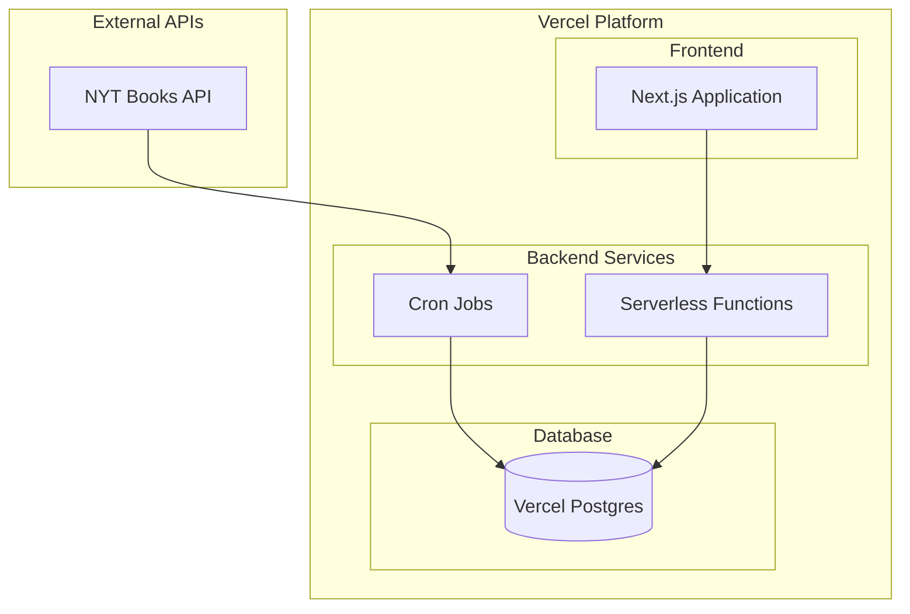

# NYT Reading Room システム設計書

## 1. システム概要

### 1.1 目的

New York Times Books API を活用し、以下の機能を提供する Web サービスを構築する：

- 最新のベストセラー情報の提供
- 書籍の詳細情報の提供
- 書評情報の提供
- ベストセラーの履歴データの提供

### 1.2 主要機能

**ベストセラー関連**

- 最新のベストセラーリスト表示
- カテゴリー別ベストセラー表示
- ベストセラー履歴表示
- 長期ベストセラー表示（weeks_on_list に基づく）

**書評関連**

- 書籍別の書評表示
- 最新の書評一覧
- 注目の書評本の表示

**書籍情報関連**

- 詳細情報の表示
- Amazon 購入リンク
- カテゴリー別表示

## 2. システムアーキテクチャ

### 2.1 全体構成



### 2.2 使用技術スタック

**フロントエンド**

- Next.js 14 (App Router)
- TypeScript 5.x
- shadcn/ui
- Tailwind CSS

**バックエンド**

- Vercel Serverless Functions
- Node.js 20.x
- TypeScript 5.x
- prisma

**データベース**

- Vercel Postgres

**インフラストラクチャ**

- Vercel Platform
- Vercel Cron Jobs

### 2.3 データフロー

**バッチ処理フロー**

1. Vercel Cron Jobs を使用して NYT API から定期的にデータ取得
2. Vercel Postgres へのデータ保存
3. 差分更新の実施

**API サービスフロー**

1. フロントエンドからのリクエストを Serverless Functions で受付
2. Vercel Postgres からのデータ取得
3. レスポンス最適化

**フロントエンドフロー**

1. Next.js による SSG/ISR ページ生成
2. クライアントサイドでのデータ取得
3. UI 状態管理

## 3. 実装設計

### 3.1 ディレクトリ構造

```
.
├── README.md                     # プロジェクト概要
├── package.json                  # 依存関係定義
├── next.config.js               # Next.js設定
├── tailwind.config.js           # Tailwind CSS設定
├── postcss.config.js            # PostCSS設定
├── tsconfig.json                # TypeScript設定
├── .env                         # 環境変数（git管理外）
├── .env.example                 # 環境変数サンプル
├── prisma/                      # Prismaの設定とマイグレーション
│   ├── schema.prisma            # データベーススキーマ
│   ├── migrations/              # マイグレーションファイル
│   └── seed.ts                  # シードデータ
│
├── public/                      # 静的ファイル
│   └── images/                  # 画像ファイル
│
├── src/                         # ソースコード
│   ├── app/                     # Next.js App Router
│   │   ├── layout.tsx           # ルートレイアウト
│   │   ├── page.tsx             # トップページ
│   │   ├── loading.tsx          # ローディング
│   │   ├── error.tsx            # エラーページ
│   │   ├── not-found.tsx        # 404ページ
│   │   ├── books/
│   │   │   ├── [id]/
│   │   │   │   └── page.tsx     # 書籍詳細ページ
│   │   │   └── page.tsx         # 書籍一覧ページ
│   │   ├── categories/
│   │   │   ├── [category]/
│   │   │   │   └── page.tsx     # カテゴリー別ページ
│   │   │   └── page.tsx         # カテゴリー一覧
│   │   └── bestsellers/
│   │       └── history/
│   │           └── page.tsx     # 過去のベストセラー
│   │
│   ├── components/              # Reactコンポーネント
│   │   ├── ui/                  # 共通UIコンポーネント
│   │   ├── layout/             # レイアウトコンポーネント
│   │   ├── books/              # 書籍関連コンポーネント
│   │   └── shared/             # 共通コンポーネント
│   │
│   ├── lib/                    # ユーティリティ
│   │   ├── prisma.ts           # Prismaクライアント
│   │   ├── nyt/                # NYT API関連
│   │   │   ├── client.ts       # APIクライアント
│   │   │   └── types.ts        # 型定義
│   │   ├── utils/              # ユーティリティ関数
│   │   └── hooks/              # カスタムフック
│   │
│   ├── types/                  # 型定義
│   │   ├── book.ts
│   │   ├── review.ts
│   │   └── category.ts
│   │
│   └── batch/                  # バッチ処理
│       ├── update-books.ts     # 書籍データ更新バッチ
│       └── utils/              # バッチ処理用ユーティリティ
│
└── vercel.json                 # Vercel設定
```

### 3.2 型定義

```typescript
// types/book.ts
export interface Book {
  id: number;
  title: string;
  author: string;
  description: string;
  bookImageUrl: string;
  amazonUrl: string;
  publisher: string;
  isbn13: string;
  rank?: number;
  rankLastWeek?: number;
  weeksOnList?: number;
  reviews?: Review[];
}

// types/review.ts
export interface Review {
  id: number;
  bookId: number;
  reviewerName: string;
  summary: string;
  content: string;
  publishDate: string;
  url: string;
}

// types/category.ts
export interface Category {
  id: string;
  name: string;
  displayName: string;
  updateFrequency: "WEEKLY" | "MONTHLY";
  books: Book[];
}
```

### 3.3 ページ構成

**トップページ**

- 最新のベストセラー（上位 5 冊）
- 注目の書評本（3 冊）
- 長期ベストセラー（3 冊）
- カテゴリー別トップ 3
- ページネーション: 不要
- データ更新: ISR（6 時間）

**カテゴリー一覧ページ**

- 全カテゴリーのグリッド表示
- 各カテゴリーカード：
  - カテゴリー名
  - 最新の 1 位書籍表紙
  - 書籍数
  - 更新頻度
- データ更新: ISR（6 時間）

**カテゴリー別ページ**

- カテゴリートップ 5 の大きな表示
- 全書籍のグリッド表示
- ページネーション: 12 冊ごと
- データ更新: ISR（6 時間）

**書籍詳細ページ**

- 基本情報（タイトル、著者、画像等）
- ベストセラー情報（順位、期間等）
- 書評セクション
- Amazon 購入ボタン
- データ更新: ISR（24 時間）

**過去のベストセラーページ**

- 過去 5 年分のデータ表示
- フィルター機能
- 時系列順表示
- ページネーション: 20 件ごと
- データ更新: ISR（24 時間）

### 3.4 コンポーネント設計

**共通コンポーネント**

- Header: グローバルナビゲーション
- Footer: サイト情報
- LoadingSkeleton: ローディング表示
- ErrorMessage: エラー表示

**書籍関連コンポーネント**

- BookCard: 書籍情報カード
- BookGrid: 書籍グリッド表示
- BookDetail: 詳細情報表示
- ReviewList: 書評一覧

**トップページコンポーネント**

- BestsellerSection: ベストセラー表示
- ReviewedBooks: 書評本セクション
- LongTermBestsellers: 長期ベストセラー
- CategoryTopBooks: カテゴリー別トップ書籍

### 3.5 データフェッチング

**基本戦略**

- ページレベルでのサーバーサイドフェッチ
- ISR によるキャッシュ
- エラー時のフォールバック UI

**キャッシュ戦略**

- トップページ: 6 時間
- カテゴリーページ: 6 時間
- 書籍詳細: 24 時間
- 過去データ: 24 時間

### 3.6 エラーハンドリング

- ローディング状態の表示
- エラー時のフォールバック UI
- リトライ機能の実装
- 404 ページの提供

### 3.7 バッチ処理設計

#### 3.7.1 基本設計

**実行方法**

- Vercel Cron Jobs を使用して Serverless Functions を定期的に呼び出し
- 実行時間制限: 10 秒以内で処理を完了する必要あり
- メモリ制限: 1024MB

**実行スケジュール**

```plaintext
# vercel.json
{
  "crons": [
    {
      "path": "/api/batch/bestsellers",
      "schedule": "0 9 * * *"     # 毎日午前9時
    },
    {
      "path": "/api/batch/reviews",
      "schedule": "0 */6 * * *"   # 6時間ごと
    }
  ]
}
```

#### 3.7.2 実装例

```typescript
// src/app/api/batch/bestsellers/route.ts
import { NextResponse } from "next/server";
import { PrismaClient } from "@prisma/client";
import { NytApiClient } from "@/lib/nyt/client";

const prisma = new PrismaClient();
const nytClient = new NytApiClient();

// Vercel Serverless Functionのタイムアウト対策として
// 処理を小分けにする
async function updateBestsellerList(listName: string) {
  const books = await nytClient.getBestsellersByList(listName);

  // 一括更新用のデータを準備
  const upsertData = books.map((book) => ({
    where: { isbn13: book.isbn13 },
    update: {
      rank: book.rank,
      rankLastWeek: book.rankLastWeek,
      weeksOnList: book.weeksOnList,
      updatedAt: new Date(),
    },
    create: {
      isbn13: book.isbn13,
      title: book.title,
      author: book.author,
      // ... その他の初期データ
    },
  }));

  // トランザクションで一括更新
  await prisma.$transaction(upsertData.map((data) => prisma.book.upsert(data)));
}

export async function POST(request: Request) {
  try {
    // 処理対象のリスト取得
    const lists = ["hardcover-fiction", "hardcover-nonfiction"];

    // 並列処理で実行時間を短縮
    await Promise.all(lists.map((list) => updateBestsellerList(list)));

    return NextResponse.json({
      success: true,
      message: "Bestseller lists updated",
    });
  } catch (error) {
    console.error("Batch processing error:", error);
    return NextResponse.json(
      {
        success: false,
        error: "Update failed",
      },
      { status: 500 }
    );
  }
}
```

#### 3.7.3 最適化のポイント

**1. 処理の分割**

- Serverless Functions の実行時間制限（10 秒）を考慮
- 大きな処理は複数の関数に分割
- 必要に応じて処理をチェーン化

```typescript
// 処理のチェーン化例
async function processList(listName: string) {
  // 1. 最初のバッチで基本データを更新
  await fetch("/api/batch/bestsellers", {
    method: "POST",
    body: JSON.stringify({ list: listName }),
  });

  // 2. 次のバッチで詳細データを更新
  await fetch("/api/batch/book-details", {
    method: "POST",
    body: JSON.stringify({ list: listName }),
  });
}
```

**2. データベースアクセスの最適化**

- 一括更新の活用
- インデックスの適切な設定
- 不要なクエリの削除

**3. エラーハンドリング**

```typescript
// リトライ機能の実装例
async function withRetry<T>(fn: () => Promise<T>, retries = 3): Promise<T> {
  try {
    return await fn();
  } catch (error) {
    if (retries > 0) {
      await new Promise((r) => setTimeout(r, 1000));
      return withRetry(fn, retries - 1);
    }
    throw error;
  }
}
```

#### 3.7.4 監視とログ

**実行ログ**

```typescript
// src/lib/logger.ts
export async function logBatchExecution(
  batchName: string,
  status: string,
  details: any
) {
  await prisma.batchLog.create({
    data: {
      batchName,
      status,
      executionDate: new Date(),
      details: JSON.stringify(details),
    },
  });
}
```

**監視項目**

- 実行成功/失敗の記録
- 処理時間の計測
- 更新レコード数の記録
- エラー内容の保存

これらのログは Vercel Dashboard で確認可能です。

## 4. システムの特徴

### 4.1 パフォーマンス最適化

- Vercel のエッジネットワークを活用した高速配信
- Next.js の SSG/ISR による効率的なページ生成
- 画像最適化
- コード分割

### 4.2 スケーラビリティ

- Vercel Platform による自動スケーリング
- Serverless Functions の柔軟な拡張性

### 4.3 保守性

- 明確な責務分離
- 型安全性の確保
- Vercel ダッシュボードによる統合監視
- 自動デプロイメント

## 5. 開発・運用方針

### 5.1 開発環境

- Vercel CLI を活用したローカル開発環境
- GitHub との連携による効率的な開発フロー
- 共通の開発規約適用

### 5.2 デプロイメント

- GitHub と Vercel の連携による CI/CD
- プレビューデプロイメントの活用
- 段階的なデプロイ戦略

### 5.3 監視・運用

- Vercel ダッシュボードによるエラー監視
- パフォーマンス監視
- 利用統計の収集
- Vercel Postgres の自動バックアップ

## 6. コスト最適化

### 6.1 Vercel 無料プランの活用

- 個人プロジェクトや小規模チームに適した無料枠の利用
- 必要に応じたアップグレードオプション

### 6.2 データベース利用の最適化

- Vercel Postgres の無料枠内での効率的なデータ管理
- 不要なデータの定期的なクリーンアップ

### 6.3 API コール最適化

- NYT Books API の呼び出し頻度の最適化
- データのキャッシュ戦略の実装

## 7. 多言語対応

### 7.1 フロントエンド

- Next.js の国際化機能を活用
- 言語切り替え機能の実装

### 7.2 コンテンツ管理

- 翻訳データの効率的な管理
- 必要に応じた外部翻訳 API の利用検討
