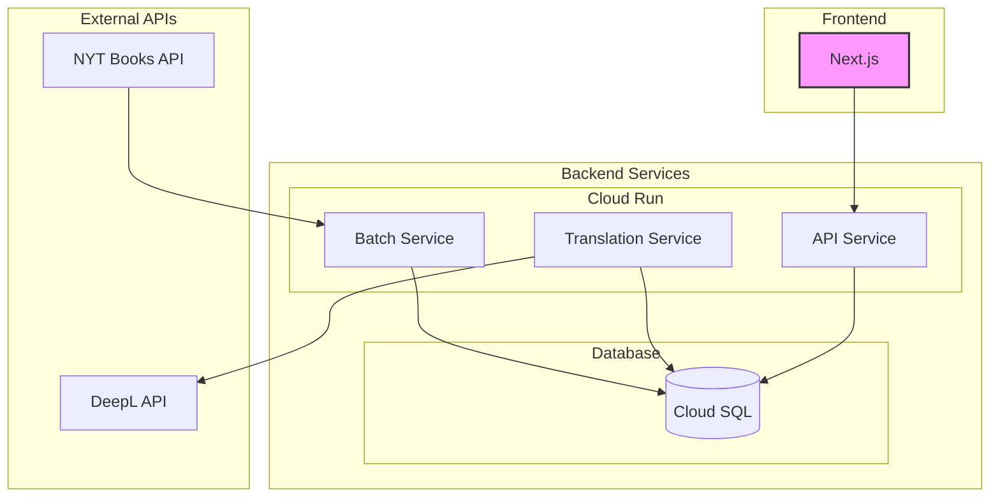

# NYT Reading Room システム設計書

## 1. システムアーキテクチャ

### 1.1 全体構成



### 1.2 使用技術

- フロントエンド
  - Next.js 14 (App Router)
  - TypeScript 5.x
  - shadcn/ui
  - Tailwind CSS
- バックエンド
  - Node.js 20.x
  - Express 4.x
  - TypeScript 5.x
- データベース
  - PostgreSQL 15
- インフラ
  - Google Cloud Run
  - Google Cloud SQL
  - Google Cloud Scheduler

## 2. NYT API 統合

### 2.1 利用する API エンドポイント

#### 2.1.1 書籍リスト取得

```typescript
interface BooksListRequest {
  endpoint: "/lists.json";
  params: {
    list: string; // required
    "api-key": string; // required
    offset?: number; // multiple of 20
    published_date?: string; // YYYY-MM-DD
  };
}

interface BooksListResponse {
  status: string;
  copyright: string;
  num_results: number;
  results: Array<{
    list_name: string;
    bestsellers_date: string;
    published_date: string;
    rank: number;
    rank_last_week: number;
    weeks_on_list: number;
    amazon_product_url: string;
    book_details: Array<{
      title: string;
      description: string;
      contributor: string;
      author: string;
      publisher: string;
      primary_isbn13: string;
    }>;
  }>;
}
```

#### 2.1.2 書評取得

```typescript
interface ReviewsRequest {
  endpoint: "/reviews.json";
  params: {
    "api-key": string; // required
    isbn: string; // ISBN-10 or ISBN-13
  };
}

interface ReviewsResponse {
  status: string;
  copyright: string;
  num_results: number;
  results: Array<{
    url: string;
    publication_dt: string;
    byline: string;
    book_title: string;
    book_author: string;
    summary: string;
  }>;
}
```

### 2.2 バッチ処理フロー

```typescript
// バッチ処理の実装例
async function fetchAndStoreBooksData() {
  try {
    // 1. 最新のリスト情報を取得
    const lists = await fetchNYTLists();

    // 2. 各リストの書籍情報を取得
    for (const list of lists) {
      const books = await fetchBooksForList(list.list_name);

      // 3. 新規書籍のみをデータベースに保存
      await storeNewBooks(books);

      // 4. 書評情報を取得
      for (const book of books) {
        const reviews = await fetchReviews(book.primary_isbn13);
        await storeReviews(book.id, reviews);
      }

      // 5. 未翻訳コンテンツの翻訳をキュー
      await queueTranslations(books);
    }
  } catch (error) {
    console.error("Batch processing failed:", error);
    throw error;
  }
}
```

## 3. データベース設計

### 3.1 テーブルスキーマ

```sql
-- books: 書籍基本情報
CREATE TABLE books (
    id SERIAL PRIMARY KEY,
    nyt_id VARCHAR(255) UNIQUE NOT NULL,
    title VARCHAR(255) NOT NULL,
    author VARCHAR(255) NOT NULL,
    description TEXT,
    book_image_url VARCHAR(512),
    amazon_url VARCHAR(512),
    publisher VARCHAR(255),
    published_date DATE,
    category VARCHAR(100),
    isbn13 VARCHAR(13),
    created_at TIMESTAMP WITH TIME ZONE DEFAULT CURRENT_TIMESTAMP,
    CONSTRAINT uk_books_isbn UNIQUE (isbn13)
);

-- translations: 翻訳データ
CREATE TABLE translations (
    id SERIAL PRIMARY KEY,
    book_id INTEGER REFERENCES books(id) ON DELETE CASCADE,
    language VARCHAR(10) NOT NULL,
    title VARCHAR(255) NOT NULL,
    description TEXT,
    translated_at TIMESTAMP WITH TIME ZONE DEFAULT CURRENT_TIMESTAMP,
    CONSTRAINT uk_translations_book_lang UNIQUE (book_id, language)
);

-- reviews: 書評データ
CREATE TABLE reviews (
    id SERIAL PRIMARY KEY,
    book_id INTEGER REFERENCES books(id) ON DELETE CASCADE,
    reviewer VARCHAR(255),
    review_text TEXT,
    review_date DATE,
    review_url VARCHAR(512),
    created_at TIMESTAMP WITH TIME ZONE DEFAULT CURRENT_TIMESTAMP,
    CONSTRAINT uk_reviews_url UNIQUE (review_url)
);
```

### 3.2 型定義（TypeScript）

```typescript
interface Book {
  id: number;
  nytId: string;
  title: string;
  author: string;
  description: string;
  bookImageUrl: string;
  amazonUrl: string;
  publisher: string;
  publishedDate: Date;
  category: string;
  isbn13: string;
  translations?: Translation[];
  reviews?: Review[];
}

interface Translation {
  id: number;
  bookId: number;
  language: "en" | "ja";
  title: string;
  description: string;
  translatedAt: Date;
}

interface Review {
  id: number;
  bookId: number;
  reviewer: string;
  reviewText: string;
  reviewDate: Date;
  reviewUrl: string;
}
```

## 4. NYT API 詳細仕様

### 4.1 API 概要

New York Times Books API は以下の 7 つの主要エンドポイントを提供しています：

1. ベストセラーリスト取得
2. 日付指定ベストセラー取得
3. ベストセラー履歴取得
4. 全ベストセラーリスト取得
5. リスト名取得
6. トップ 5 ベストセラー取得
7. 書評取得

### 4.2 エンドポイント詳細

#### 4.2.1 ベストセラーリスト取得 (/lists.json)

```typescript
interface ListsRequest {
  endpoint: string = "/lists.json";
  method: "GET";
  params: {
    "api-key": string; // Required: API認証キー
    list: string; // Required: リスト名（例: "hardcover-fiction"）
    "bestsellers-date"?: string; // Optional: YYYY-MM-DD形式
    "published-date"?: string; // Optional: YYYY-MM-DD形式
    offset?: number; // Optional: 20の倍数
  };
}

interface ListsResponse {
  status: string;
  copyright: string;
  num_results: number;
  last_modified: string;
  results: Array<{
    list_name: string;
    display_name: string;
    bestsellers_date: string;
    published_date: string;
    rank: number;
    rank_last_week: number;
    weeks_on_list: number;
    amazon_product_url: string;
    book_details: Array<{
      title: string;
      description: string;
      contributor: string;
      author: string;
      publisher: string;
      primary_isbn13: string;
      primary_isbn10: string;
    }>;
  }>;
}
```

#### 4.2.2 日付指定ベストセラー取得 (/lists/{date}/{list}.json)

```typescript
interface DateListRequest {
  endpoint: string = "/lists/{date}/{list}.json";
  method: "GET";
  params: {
    "api-key": string; // Required: API認証キー
    date: string; // Required: YYYY-MM-DD形式 or "current"
    list: string; // Required: リスト名
    offset?: number; // Optional: 20の倍数
  };
}

interface DateListResponse {
  status: string;
  copyright: string;
  num_results: number;
  last_modified: string;
  results: {
    list_name: string;
    bestsellers_date: string;
    published_date: string;
    display_name: string;
    normal_list_ends_at: number;
    updated: string;
    books: Array<{
      rank: number;
      rank_last_week: number;
      weeks_on_list: number;
      primary_isbn10: string;
      primary_isbn13: string;
      publisher: string;
      description: string;
      title: string;
      author: string;
      book_image: string;
      amazon_product_url: string;
    }>;
  };
}
```

#### 4.2.3 書評取得 (/reviews.json)

```typescript
interface ReviewsRequest {
  endpoint: string = "/reviews.json";
  method: "GET";
  params: {
    "api-key": string; // Required: API認証キー
    isbn?: string; // Optional: ISBN-10 or ISBN-13
    title?: string; // Optional: 完全な書籍タイトル
    author?: string; // Optional: 著者名
  };
}

interface ReviewsResponse {
  status: string;
  copyright: string;
  num_results: number;
  results: Array<{
    url: string;
    publication_dt: string;
    byline: string;
    book_title: string;
    book_author: string;
    summary: string;
    isbn13: string[];
  }>;
}
```

### 4.3 API 利用実装例

#### 4.3.1 API クライアントの実装

```typescript
class NYTBooksAPI {
  private apiKey: string;
  private baseURL: string = "https://api.nytimes.com/svc/books/v3";

  constructor(apiKey: string) {
    this.apiKey = apiKey;
  }

  // ベストセラーリスト取得
  async getBooksList(
    listName: string,
    options?: {
      bestsellersDate?: string;
      publishedDate?: string;
    }
  ): Promise<ListsResponse> {
    const params = new URLSearchParams({
      "api-key": this.apiKey,
      list: listName,
      ...options,
    });

    const response = await fetch(
      `${this.baseURL}/lists.json?${params.toString()}`
    );

    if (!response.ok) {
      throw new Error(`NYT API error: ${response.statusText}`);
    }

    return response.json();
  }

  // 書評取得
  async getBookReviews(isbn: string): Promise<ReviewsResponse> {
    const params = new URLSearchParams({
      "api-key": this.apiKey,
      isbn: isbn,
    });

    const response = await fetch(
      `${this.baseURL}/reviews.json?${params.toString()}`
    );

    if (!response.ok) {
      throw new Error(`NYT API error: ${response.statusText}`);
    }

    return response.json();
  }
}
```

#### 4.3.2 バッチ処理での利用例

```typescript
async function fetchDailyBestSellers() {
  const api = new NYTBooksAPI(process.env.NYT_API_KEY!);
  const db = new DatabaseClient();

  try {
    // リスト名の取得
    const lists = await api.getListNames();

    // 各リストのデータを取得
    for (const list of lists.results) {
      const booksData = await api.getBooksList(list.list_name_encoded);

      // 新規書籍のみを抽出
      const newBooks = await filterNewBooks(booksData.results);

      // 書籍情報の保存
      for (const book of newBooks) {
        // 基本情報の保存
        const savedBook = await db.books.create({
          data: transformBookData(book),
        });

        // 書評の取得と保存
        if (book.primary_isbn13) {
          const reviews = await api.getBookReviews(book.primary_isbn13);
          await db.reviews.createMany({
            data: transformReviewsData(reviews.results, savedBook.id),
          });
        }
      }
    }
  } catch (error) {
    console.error("Error fetching bestsellers:", error);
    throw error;
  }
}
```

### 4.4 エラーハンドリング

#### 4.4.1 API エラーの種類

```typescript
enum NYTAPIErrorType {
  RATE_LIMIT_EXCEEDED = "RATE_LIMIT_EXCEEDED",
  INVALID_API_KEY = "INVALID_API_KEY",
  INVALID_PARAMETER = "INVALID_PARAMETER",
  NOT_FOUND = "NOT_FOUND",
  SERVER_ERROR = "SERVER_ERROR",
}

class NYTAPIError extends Error {
  constructor(
    public type: NYTAPIErrorType,
    public status: number,
    message: string
  ) {
    super(message);
    this.name = "NYTAPIError";
  }
}
```

#### 4.4.2 エラーハンドリングの実装

```typescript
async function handleAPIError(error: unknown): Promise<void> {
  if (error instanceof NYTAPIError) {
    switch (error.type) {
      case NYTAPIErrorType.RATE_LIMIT_EXCEEDED:
        await delay(60000); // 1分待機
        return; // リトライ

      case NYTAPIErrorType.INVALID_API_KEY:
        notifyAdministrator("Invalid API Key");
        throw error;

      case NYTAPIErrorType.NOT_FOUND:
        console.warn("Resource not found:", error.message);
        return;

      default:
        console.error("NYT API Error:", error);
        throw error;
    }
  }

  console.error("Unexpected error:", error);
  throw error;
}
```

## 5. フロントエンド実装

### 5.1 ディレクトリ構成

```
src/
├── app/
│   ├── [locale]/
│   │   ├── page.tsx
│   │   ├── books/
│   │   │   ├── [category]/
│   │   │   │   └── page.tsx
│   │   │   └── [id]/
│   │   │       └── page.tsx
│   │   └── layout.tsx
│   └── api/
├── components/
│   ├── books/
│   │   ├── BookCard.tsx
│   │   ├── BookGrid.tsx
│   │   └── BookDetail.tsx
│   └── layout/
└── lib/
    ├── api.ts
    └── types.ts
```

### 5.2 コンポーネント実装例

```typescript
// BookCard コンポーネント
interface BookCardProps {
  book: Book;
  language: "en" | "ja";
}

const BookCard: React.FC<BookCardProps> = ({ book, language }) => {
  const title =
    language === "ja" && book.translations?.[0]
      ? book.translations[0].title
      : book.title;

  return (
    <Card className="h-full">
      <CardHeader>
        <CardTitle>{title}</CardTitle>
        <CardDescription>{book.author}</CardDescription>
      </CardHeader>
      <CardContent>
        {book.bookImageUrl && (
          
        )}
      </CardContent>
      <CardFooter>
        <Button asChild>
          <a href={book.amazonUrl} target="_blank" rel="noopener noreferrer">
            View on Amazon
          </a>
        </Button>
      </CardFooter>
    </Card>
  );
};
```

## 6. バッチ処理

### 6.1 スケジュール設定

```yaml
# Cloud Scheduler 設定
jobs:
  - name: fetch-nyt-books
    schedule: "0 0 * * *" # 毎日0時に実行
    target:
      service: batch-service
      path: /tasks/fetch-books

  - name: process-translations
    schedule: "0 */2 * * *" # 2時間ごとに実行
    target:
      service: translation-service
      path: /tasks/process-translations
```

### 6.2 エラーハンドリング

```typescript
// バッチ処理のエラーハンドリング
async function handleBatchError(error: Error, context: BatchContext) {
  // エラーログの保存
  await prisma.batchLog.create({
    data: {
      batchType: context.type,
      error: error.message,
      status: "ERROR",
      details: JSON.stringify({
        stack: error.stack,
        context,
      }),
    },
  });

  // リトライ処理
  if (context.retryCount < 3) {
    await scheduleRetry(context);
  }
}
```
