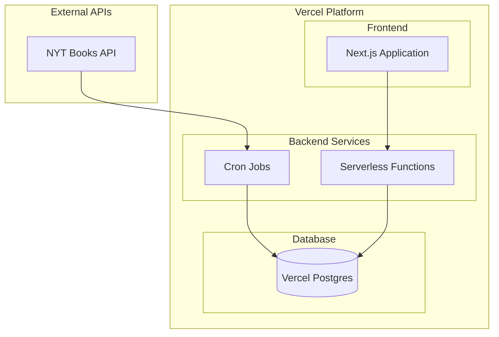

# NYT Reading Room システム設計書

## 1. システム概要

### 1.1 目的

New York Times Books API を活用し、以下の機能を提供する Web サービスを構築する：

- 最新のベストセラー情報の提供
- 書籍の詳細情報の提供
- 書評情報の提供
- ベストセラーの履歴データの提供

### 1.2 主要機能

**ベストセラー関連**

- 最新のベストセラーリスト表示
- カテゴリー別ベストセラー表示
- ベストセラー履歴表示
- 長期ベストセラー表示（weeks_on_list に基づく）

**書評関連**

- 書籍別の書評表示
- 最新の書評一覧
- 注目の書評本の表示

**書籍情報関連**

- 詳細情報の表示
- Amazon 購入リンク
- カテゴリー別表示

## 2. システムアーキテクチャ

### 2.1 全体構成



### 2.2 使用技術スタック

**フロントエンド**

- Next.js 14 (App Router)
- TypeScript 5.x
- shadcn/ui
- Tailwind CSS

**バックエンド**

- Vercel Serverless Functions
- Node.js 20.x
- TypeScript 5.x
- prisma

**データベース**

- Vercel Postgres

**インフラストラクチャ**

- Vercel Platform
- Vercel Cron Jobs

### 2.3 データフロー

**バッチ処理フロー**

1. Vercel Cron Jobs を使用して NYT API から定期的にデータ取得
2. Vercel Postgres へのデータ保存
3. 差分更新の実施

**API サービスフロー**

1. フロントエンドからのリクエストを Serverless Functions で受付
2. Vercel Postgres からのデータ取得
3. レスポンス最適化

**フロントエンドフロー**

1. Next.js による SSG/ISR ページ生成
2. クライアントサイドでのデータ取得
3. UI 状態管理

## 3. フロントエンド設計

### 3.1 ディレクトリ構造

```
src/
├── app/
│   ├── layout.tsx                # ルートレイアウト
│   ├── page.tsx                  # トップページ
│   ├── loading.tsx               # ローディング
│   ├── error.tsx                 # エラーページ
│   ├── not-found.tsx             # 404ページ
│   ├── books/
│   │   ├── [id]/
│   │   │   └── page.tsx         # 書籍詳細ページ
│   │   └── page.tsx             # 書籍一覧ページ
│   ├── categories/
│   │   ├── page.tsx             # カテゴリー一覧
│   │   └── [category]/
│   │       └── page.tsx         # カテゴリー別ページ
│   └── bestsellers/
│       └── history/
│           └── page.tsx         # 過去のベストセラー
├── components/
│   ├── ui/                      # shadcn/uiコンポーネント
│   ├── layout/                  # レイアウトコンポーネント
│   ├── home/                    # トップページ用コンポーネント
│   ├── books/                   # 書籍関連コンポーネント
│   └── shared/                  # 共通コンポーネント
├── lib/
│   ├── api/
│   │   └── mock/                # モックデータ
│   ├── hooks/                   # カスタムフック
│   └── utils/                   # ユーティリティ関数
├── types/                       # 型定義
└── public/
    └── images/                  # 静的画像
```

### 3.2 型定義

```typescript
// types/book.ts
export interface Book {
  id: number;
  title: string;
  author: string;
  description: string;
  bookImageUrl: string;
  amazonUrl: string;
  publisher: string;
  isbn13: string;
  rank?: number;
  rankLastWeek?: number;
  weeksOnList?: number;
  reviews?: Review[];
}

// types/review.ts
export interface Review {
  id: number;
  bookId: number;
  reviewerName: string;
  summary: string;
  content: string;
  publishDate: string;
  url: string;
}

// types/category.ts
export interface Category {
  id: string;
  name: string;
  displayName: string;
  updateFrequency: "WEEKLY" | "MONTHLY";
  books: Book[];
}
```

### 3.3 ページ構成

**トップページ**

- 最新のベストセラー（上位 5 冊）
- 注目の書評本（3 冊）
- 長期ベストセラー（3 冊）
- カテゴリー別トップ 3
- ページネーション: 不要
- データ更新: ISR（6 時間）

**カテゴリー一覧ページ**

- 全カテゴリーのグリッド表示
- 各カテゴリーカード：
  - カテゴリー名
  - 最新の 1 位書籍表紙
  - 書籍数
  - 更新頻度
- データ更新: ISR（6 時間）

**カテゴリー別ページ**

- カテゴリートップ 5 の大きな表示
- 全書籍のグリッド表示
- ページネーション: 12 冊ごと
- データ更新: ISR（6 時間）

**書籍詳細ページ**

- 基本情報（タイトル、著者、画像等）
- ベストセラー情報（順位、期間等）
- 書評セクション
- Amazon 購入ボタン
- データ更新: ISR（24 時間）

**過去のベストセラーページ**

- 過去 5 年分のデータ表示
- フィルター機能
- 時系列順表示
- ページネーション: 20 件ごと
- データ更新: ISR（24 時間）

### 3.4 コンポーネント設計

**共通コンポーネント**

- Header: グローバルナビゲーション
- Footer: サイト情報
- LoadingSkeleton: ローディング表示
- ErrorMessage: エラー表示

**書籍関連コンポーネント**

- BookCard: 書籍情報カード
- BookGrid: 書籍グリッド表示
- BookDetail: 詳細情報表示
- ReviewList: 書評一覧

**トップページコンポーネント**

- BestsellerSection: ベストセラー表示
- ReviewedBooks: 書評本セクション
- LongTermBestsellers: 長期ベストセラー
- CategoryTopBooks: カテゴリー別トップ書籍

### 3.5 データフェッチング

**基本戦略**

- ページレベルでのサーバーサイドフェッチ
- ISR によるキャッシュ
- エラー時のフォールバック UI

**キャッシュ戦略**

- トップページ: 6 時間
- カテゴリーページ: 6 時間
- 書籍詳細: 24 時間
- 過去データ: 24 時間

### 3.6 エラーハンドリング

- ローディング状態の表示
- エラー時のフォールバック UI
- リトライ機能の実装
- 404 ページの提供

## 4. システムの特徴

### 4.1 パフォーマンス最適化

- Vercel のエッジネットワークを活用した高速配信
- Next.js の SSG/ISR による効率的なページ生成
- 画像最適化
- コード分割

### 4.2 スケーラビリティ

- Vercel Platform による自動スケーリング
- Serverless Functions の柔軟な拡張性

### 4.3 保守性

- 明確な責務分離
- 型安全性の確保
- Vercel ダッシュボードによる統合監視
- 自動デプロイメント

## 5. 開発・運用方針

### 5.1 開発環境

- Vercel CLI を活用したローカル開発環境
- GitHub との連携による効率的な開発フロー
- 共通の開発規約適用

### 5.2 デプロイメント

- GitHub と Vercel の連携による CI/CD
- プレビューデプロイメントの活用
- 段階的なデプロイ戦略

### 5.3 監視・運用

- Vercel ダッシュボードによるエラー監視
- パフォーマンス監視
- 利用統計の収集
- Vercel Postgres の自動バックアップ

## 6. コスト最適化

### 6.1 Vercel 無料プランの活用

- 個人プロジェクトや小規模チームに適した無料枠の利用
- 必要に応じたアップグレードオプション

### 6.2 データベース利用の最適化

- Vercel Postgres の無料枠内での効率的なデータ管理
- 不要なデータの定期的なクリーンアップ

### 6.3 API コール最適化

- NYT Books API の呼び出し頻度の最適化
- データのキャッシュ戦略の実装

## 7. 多言語対応

### 7.1 フロントエンド

- Next.js の国際化機能を活用
- 言語切り替え機能の実装

### 7.2 コンテンツ管理

- 翻訳データの効率的な管理
- 必要に応じた外部翻訳 API の利用検討
