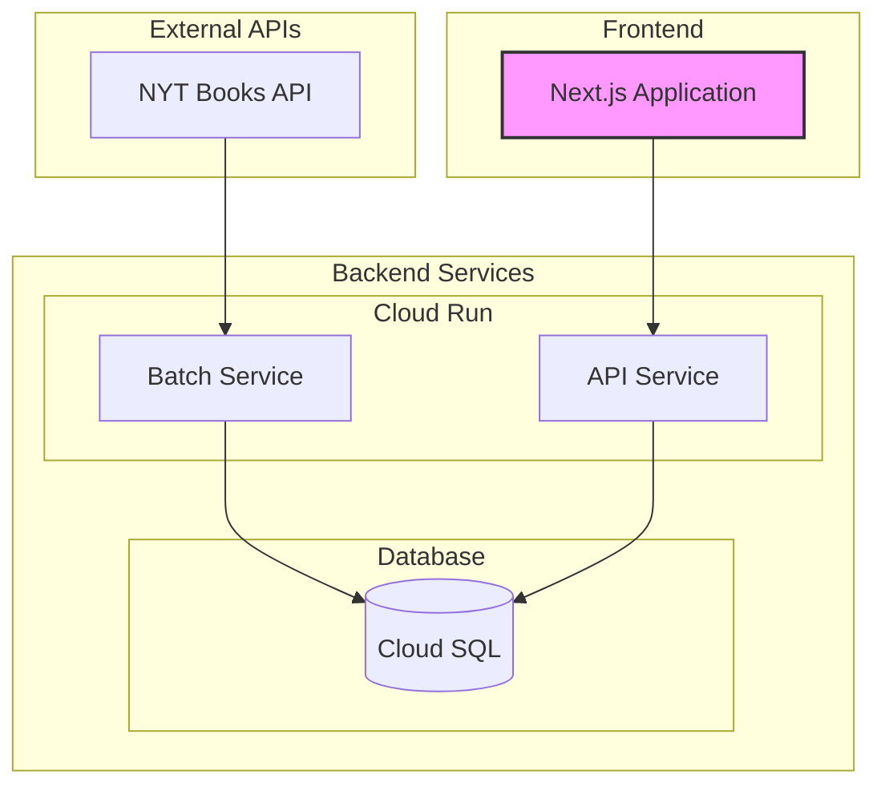

# NYT Reading Room システム設計書

## Part 1: システム概要とアーキテクチャ

## 1. システム概要

### 1.1 目的

New York Times Books API を活用し、以下の機能を提供する Web サービスを構築する：

- 最新のベストセラー情報の提供
- 書籍の詳細情報の提供
- 書評情報の提供
- ベストセラーの履歴データの提供

### 1.2 主要機能

1. ベストセラー関連

   - 最新のベストセラーリスト表示
   - カテゴリー別ベストセラー表示
   - ベストセラー履歴表示
   - 長期ベストセラー表示（weeks_on_list に基づく）

2. 書評関連

   - 書籍別の書評表示
   - 最新の書評一覧
   - 注目の書評本の表示

3. 書籍情報関連
   - 詳細情報の表示
   - Amazon 購入リンク
   - カテゴリー別表示

## 2. システムアーキテクチャ

### 2.1 全体構成

### 2.2 使用技術スタック

#### フロントエンド

- Next.js 14 (App Router)
- TypeScript 5.x
- shadcn/ui
- Tailwind CSS
- prisma

#### バックエンド

- Node.js 20.x
- Express 4.x
- TypeScript 5.x

#### データベース

- PostgreSQL 15

#### インフラストラクチャ

- Google Cloud Run
- Google Cloud SQL
- Google Cloud Scheduler

### 2.3 データフロー

1. バッチ処理フロー

   - NYT API からの定期的なデータ取得
   - データベースへの保存
   - 差分更新の実施

2. API サービスフロー

   - フロントエンドからのリクエスト受付
   - キャッシュ戦略の適用
   - レスポンス最適化

3. フロントエンドフロー
   - SSG/ISR によるページ生成
   - クライアントサイドでのデータ取得
   - UI 状態管理

## 3. システムの特徴

### 3.1 パフォーマンス最適化

- 効率的なキャッシング戦略
- 適切なリビルド間隔の設定
- 画像最適化
- コード分割

### 3.2 スケーラビリティ

- Cloud Run による自動スケーリング
- データベースの最適化

### 3.3 保守性

- 明確な責務分離
- 型安全性の確保
- 詳細なログ記録
- 監視体制の確立

## 4. 開発・運用方針

### 4.1 開発環境

- ローカル開発環境の統一
- Docker 活用
- 共通の開発規約適用

### 4.2 デプロイメント

- CI/CD パイプラインの構築
- 自動テストの実施
- 段階的なデプロイ

### 4.3 監視・運用

- エラー監視
- パフォーマンス監視
- 利用統計の収集
- バックアップ体制
